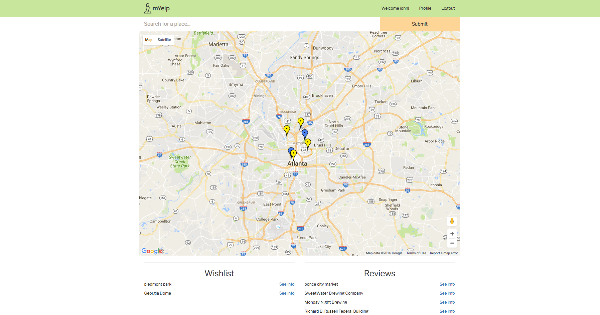
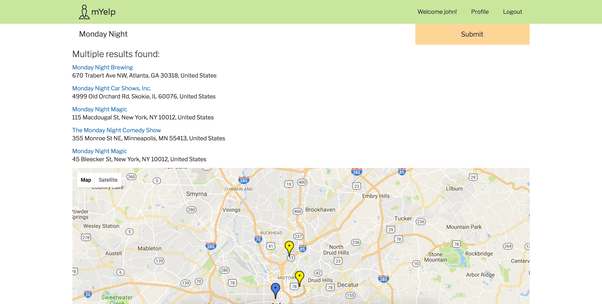
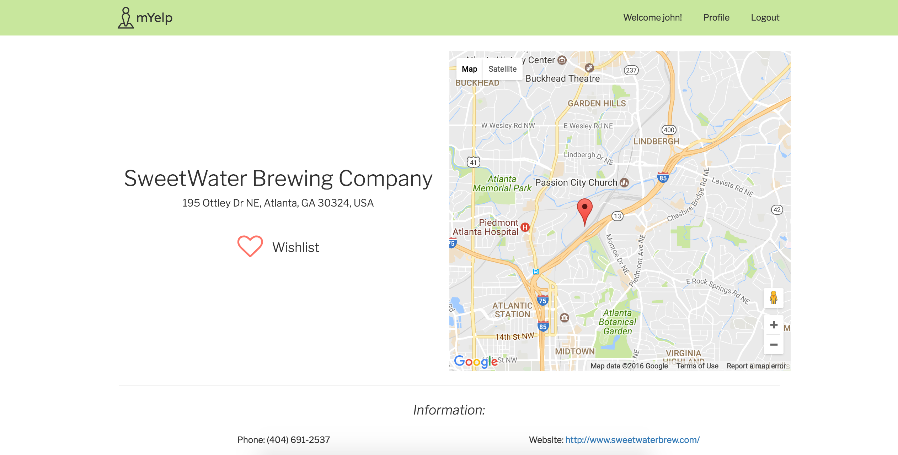
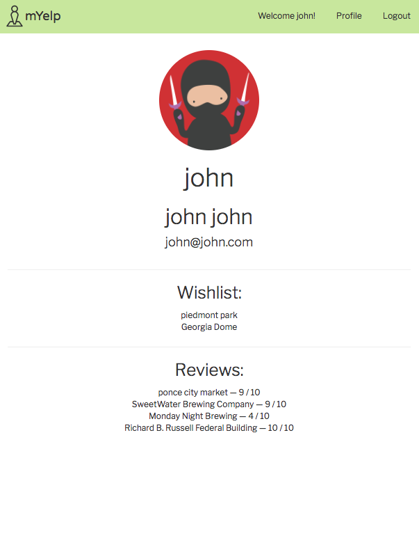
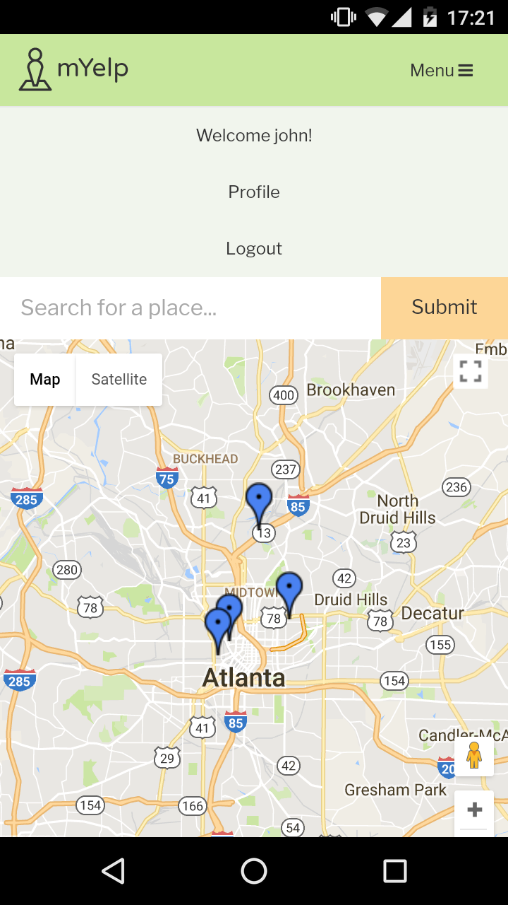

# Team Dom Ready project


######
[Live Project](http://myelp.club/#/)  |  [Overview](https://github.com/DigitalCrafts-September-2016-Cohort/team_dom_ready)   |   [Team](https://github.com/DigitalCrafts-September-2016-Cohort/team_dom_ready--roles)   |   [What We Used](https://github.com/DigitalCrafts-September-2016-Cohort/team_dom_ready#what-we-used)   |   [MVP](https://github.com/DigitalCrafts-September-2016-Cohort/team_dom_ready#mvp-minimum-viable-product)   |   [Challenges](https://github.com/DigitalCrafts-September-2016-Cohort/team_dom_ready#challenges--solutions)   |   [Code](https://github.com/DigitalCrafts-September-2016-Cohort/team_dom_ready#code-snippets)   | [Screenshots](https://github.com/DigitalCrafts-September-2016-Cohort/team_dom_ready#screenshots)   |   [Contributing](https://github.com/DigitalCrafts-September-2016-Cohort/team_dom_ready#contribute-to-nerd-review)

##Overview:
mYelp is a personal map application that can keep track of where a user has been and where they want to go. The app calls on the Google Maps API to allow the user to search for a place, see more details about it, save it to a wishlist, review it, and review their own map featuring color-coded markers identifying the places they've saved or reviewed.

**Our conceptual goals for the site:**
* Home page displays a map that can search for points of interest and clicking on one shows more details
* Users can sign up for an account and, once logged in, save places to a wishlist and write reviews about places
* Reviewed and 'wishlisted' show up marked on the main map so the user can find them easily

##Github Link:
[mYelp](https://github.com/DigitalCrafts-September-2016-Cohort/team_dom_ready.git)

##Team Members & Roles:
**Click on each member's name to see their GitHub profile**
All team members are students in the [Digital Crafts](https://digitalcrafts.com) September 2016 cohort. This project was initially completed as the second full-stack project for that curriculum and utilized the SCRUM development process and philosophy.  Mob programming were the focus in the initial stages and the majority of the app was completed through pair-programming.

####Team DOM Ready
* [John Coppola](https://github.com/johnnycopes/)  
**Contributions:**  Enabled the Google Maps API on the back-end with Python to get specific place information. Refactored functionality in JavaScript that renders the map and creates the map markers. Created a mobile-first layout using a customized version of Bootstrap and styled the page.<br />

* [Juan Cortes](https://github.com/jcortes0309)  
**Contributions:**  <br />

* [Carolyn Lam](https://github.com/Pumala)  
**Contributions:**  <br />

* [Dominic Zenon](https://github.com/Daz4ever)  
**Contributions:**  <br />

##What we used:
**Languages:**  
* Python (including the following modules)
  * PyGreSQL
  * datetime
  * os
  * dotenv
* HTML5
* CSS
* JavaScript/jQuery

**Frameworks:**  
* AngularJS 1.5.8 (including the following services)
  * ui-router
  * ngCookies
* Bootstrap

**Other:**  
* PostgreSQL
* Amazon Web Services EC2
* Apache
* Logo icon from The Noun Project
  * *Icon made by Chanut is Industries -- https://thenounproject.com/chanut-is/*


##MVP (Minimum Viable Product):
This was the first full-stack project for all team members, therefore our first experience at deciding on an MVP.  One challenge we faced was a blurring the line between our MVP and stretch goals due to a desire to make efficient use of our time, dispatching some members to advanced tasks if troubleshooting an MVP issue was a one person job.

**Initial MVP**
* Create a robust database to store info about users' places, reviews, and wishlist
* Allow the user to save places to a wishlist and/or write a review. Updating the review or wishlist should update the database accordingly
* Have the primary map recenter and zoom in appropriately on searching a place and have it link to a details page if clicked on
* Show the wishlist and reviews lists if users have marked places, and have those places show up as distinctive markers on the primary map

**Stretch goals:**
* Ability to get directions from current location to a place
* Allow users to add their own photos to a place
* Implement a network in which users can find each other and share their saved or reviewed places

## Challenges & Solutions:
**Some of the biggest challenges we faced with this project build included:**

1.  **Challenge:**

    **Solution:**

2.  **Challenge:**

    **Solution:**

3.  **Challenge:**

    **Solution:**

4. **Challenge:**

    **Solution:**


##Code Snippets

Displaying/searching the primary map:
```Python
@app.route('/api/location/<place_id>')
def location(place_id):
    place_id = str(place_id)
    user_id = request.args.get('user_id')
    # Geocoding a place id
    geocode_result = gmaps.place(place_id)

    if user_id != None:
        # make a query to see if user has already wishlisted the location or not
        query = db.query(
            '''
            SELECT
        	    location_id
            FROM
            	customer
            INNER JOIN
                wishlist_loc
                ON wishlist_loc.customer_id = customer.id
            INNER JOIN
            	location
                ON wishlist_loc.location_id=location.id
            WHERE
            	customer.id = $1 AND
                location.google_places_id = $2;
            ''', user_id, place_id).dictresult()

        if query == []:
            is_wishlisted = False
        else:
            is_wishlisted = True

        # use google_places_id to make a query to grab location id
        location_id = db.query('select id from location where google_places_id = $1', place_id).dictresult()

        # check if location exists
        if location_id == []:
            review_info = None
        else:
            # first, grab the location_id and convert into integer
            location_id = location_id[0]['id']
            location_id = int(location_id)

            # make a query to grab the review for that location
            review_id = db.query(
            '''
            SELECT
                review.id
            FROM
                customer
            INNER JOIN
                review
                ON review.customer_id = customer.id
            INNER JOIN
                location
                ON review.location_id=location.id
            WHERE
                customer.id = $1
                    AND
                        location.id = $2
            ''', user_id, location_id).dictresult()

            # if review does exist
            if review_id != []:

                # grab the review id and convert into integer
                review_id = review_id[0]['id']
                review_id = int(review_id)

                # make a query to grab the review info
                review_info = db.query(
                '''
                SELECT
                    review.title,
                    review.review,
                    review.rating
                FROM
                    review
                WHERE
                    review.id = $1
                ''', review_id).dictresult()[0]
            else:
                review_info = None

        return jsonify([
            {
            'geocode_result': geocode_result,
            'is_wishlisted': is_wishlisted,
            'review_info': review_info
            }
        ])
    else:
        return jsonify([
            {
            'geocode_result': geocode_result,
            'is_wishlisted': None,
            'review_info': None
            }
        ])
```

Example 2:
```JavaScript
service.createMarkers = function(markers, type) {
  // gather information from each stored place from the db
  markers.forEach(function(location) {
    var name = location.name;
    var place_id = location.google_places_id;
    var latitude = location.latitude;
    var longitude = location.longitude;
    var link = '<a id="mapPlace" href="/#/location/' + place_id + '">' + name + '</a>';
    var markerLatLng = {lat: latitude, lng: longitude};
    var markerType;

    // assign color depending on if the place was wishlisted or reviewed
    if (type === 'review') {
      pinColor = 'FFF000';
    }
    else if (type === 'wishlist') {
      pinColor = '4a82f1';
    }

    // create a new Google Map marker
    var marker = new google.maps.Marker({
      position: markerLatLng,
      map: map,
      icon: 'https://chart.googleapis.com/chart?chst=d_map_pin_letter&chld=%E2%80%A2%7C' + pinColor,
      title: name
    });

    var infowindow = new google.maps.InfoWindow({
      content: link,
      maxWidth: 150,
    });

    // Zoom to 15 and open the info window when marker is clicked
    google.maps.event.addListener(marker, 'click', function() {
      map.setZoom(15);
       map.setCenter(marker.getPosition());
       infowindow.open(map,marker);
    });
  });
};
```

Example 3:
```Python
@app.route('/api/location/edit/review', methods=['POST'])
def location_edit():
    results = request.get_json();
    review_info = results['review_info']
    review = review_info['review']
    review_title = review_info['title']
    review_rating = review_info['rating']
    place_id = results['location_info']['google_places_id']
    name = results['location_info']['name']
    description = results['location_info']['description']
    lat = results['location_info']['latitude']
    lng = results['location_info']['longitude']
    customer_id = int(results['user_info']['id'])

    # use google_places_id to make a query to grab location id
    location_id = db.query('select id from location where google_places_id = $1', place_id).dictresult()
    if location_id == []:
        # create a new location in the db
        db.insert(
            'location',
            {
                'name': name,
                'description': description,
                'google_places_id': place_id,
                'latitude': lat,
                'longitude': lng
            }
        )
    else:
        # first, grab the location_id and convert into integer
        location_id = location_id[0]['id']
        location_id = int(location_id)
        # make a query to check if review exists
        review_query = db.query(
        '''
        SELECT
    	    review.id
        FROM
        	customer
        INNER JOIN
            review
            ON review.customer_id = customer.id
        INNER JOIN
        	location
            ON review.location_id=location.id
        WHERE
            customer.id = $1
                AND
                    location.id = $2
        ''', customer_id, location_id).dictresult()
        if review_query == []:
            # create a new review
            db.insert(
                    'review', {
                        'title': review_title,
                        'review': review,
                        'rating': review_rating,
                        'customer_id': customer_id,
                        'location_id': location_id
                    }
                )
        else:
            review_id = review_query[0]['id']
            review_id = int(review_id)
            # update the review in the db
            db.update(
                'review', {
                    'id': review_id,
                    'title': review_title,
                    'review': review,
                    'rating': review_rating,
                    'customer_id': customer_id,
                    'location_id': location_id
                }
            )

    return jsonify(location_id)
```

##Screenshots






********

##Project History
12/02/2016 - Project completion and deployment  
11/28/2016 - Project start
